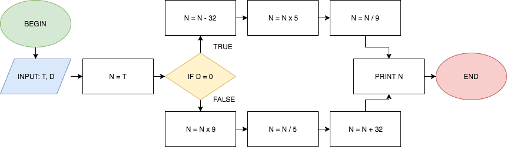

## Hello, World

+++

## What is this?

+++



+++

## Flowchart


+++

## How about this?

+++

```JavaScript

function foo(p, r, n, t) {
    return p * Math.pow(1 + r/n, n * t); 
}

```

+++

## JavaScript Code

```JavaScript

function foo(p, r, n, t) {
    return p * Math.pow(1 + r/n, n * t); 
}

```

---

## What is software engineering?

<blockquote class="fragment">
    <p>
        a branch of computer science that deals with the design, implementation, and maintenance of complex computer programs
    </p>
    <footer>- Merriam-Webster</footer>
</blockquote>

---

## For realz tho

- Recognize patterns |
- Identify opportunities |
- Connect systems |
- Solve puzzles |

---

## How about a programming exercise?

---

## What are the next steps?

1. Be curious |
2. Learn |
3. Goto #1 |
